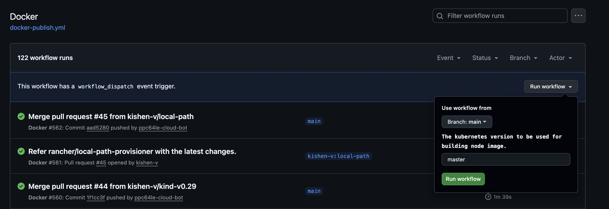

## Building images related to Kubernetes and Kind.

#### Building Kind-node images:
Kind node images are built with the version of kubernetes, it can be done by triggering the workflow
under the `Docker` workflow. As an input parameter, one needs to set the version of `Kubernetes` before
proceeding to build the node image. The default version to build is `master` You can get the latest available releases across 
the available supported versions from here https://kubernetes.io/releases/

#### Building base and kind-dependent images.
These images are built with a new release, triggering this workflow leads to building on images related to storage
networking, etc. which are internally used by the kind binary. Once the images are built successfully, the corresponding
versions are updated in the `build-ppc64le.patch` file.